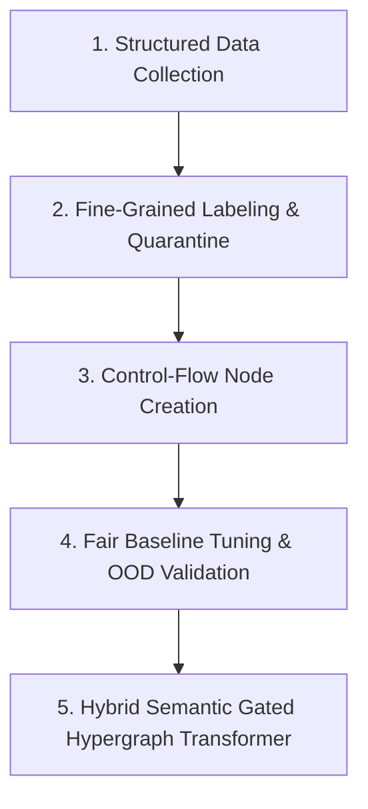
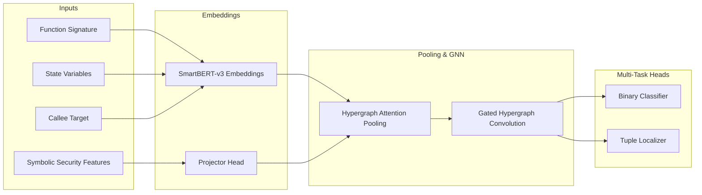

# HyperVul Project Review: Divergent Motifs, Failure Analysis, and Roadmap

This report reviews the HyperVul codebase's evolution, focusing strictly on the actual python implementations, features, and evaluation harnesses (ignoring assumptions or placeholder data in markdown documentation). It details the three divergent modeling architectures tried, evaluates how each was built and documented, lists their failure modes, and outlines a rigorous roadmap to rebuild the system from scratch.

---

## 1. Divergent Project Motifs (Code-Based Analysis)

The codebase has evolved through three distinct modeling motifs, representing different assumptions about how smart contract entities and interactions should be represented.

### Motif A: Isolated-Hyperedge Set-Pooling Classifier (No Structure)
*   **Core Concept**: Each vulnerability-relevant interaction is modeled as a self-contained "bag of nodes" consisting of a calling function, accessed state variables, and external callees (the hyperedge members). No relations *between* different interactions are represented.
*   **How it is Built in Code**:
    *   Loads node embeddings (768-dim) from a pre-trained language model, specifically `web3se/SmartBERT-v3` (`extract_features.py` [L29](file:///home/pollmix/Coding/HyperVul/scripts/latest1/extract_features.py#L29)).
    *   Applies a permutation-invariant pooling layer (`AttentionPooling` or `SequenceAwarePooling` using LSTM/Transformer in `model/latest1/model.py` [L14-L85](file:///home/pollmix/Coding/HyperVul/model/latest1/model.py#L14-L85)) to collapse the variable-length member set into a single 768-dim hyperedge vector.
    *   Feeds this vector to a standard 2-layer MLP (`Linear` -> `ReLU` -> `Dropout` -> `Linear` -> `1`) for binary classification (`HyperedgeClassifier` in `model/latest1/model.py` [L106-L126](file:///home/pollmix/Coding/HyperVul/model/latest1/model.py#L106-L126)).
    *   An interaction-aware `LocalizationHead` (`TupleLocalizationHead` in `hypervul_fair_eval/src/fair_eval/models/hypervul.py` [L11-L38](file:///home/pollmix/Coding/HyperVul/hypervul_fair_eval/src/fair_eval/models/hypervul.py#L11-L38)) acts as a per-tuple readout. It scores every combination of `(function, state, callee)` using a multi-way additive interaction mechanism ($f_{score} = W_{out} \tanh(W_f f + W_s s + W_c c)$) to output a vulnerability logit and pinpoint localizable evidence.
*   **Code Locations**:
    *   [model/latest1/model.py](file:///home/pollmix/Coding/HyperVul/model/latest1/model.py)
    *   [hypervul_fair_eval/src/fair_eval/models/hypervul.py](file:///home/pollmix/Coding/HyperVul/hypervul_fair_eval/src/fair_eval/models/hypervul.py)
    *   [scripts/task1_old_model_new_test.py](file:///home/pollmix/Coding/HyperVul/scripts/task1_old_model_new_test.py) (uses `iteration1_checkpoint.pt`)

### Motif B: Gated Heterogeneous Attention Network (G-HAN)
*   **Core Concept**: A contract is modeled as a heterogeneous graph where nodes represent interaction hyperedges and helper functions. Directed edges represent calling relationships and shared variables to propagate multi-step context (e.g., *Function A* writes to `X` and *Function B* reads from `X` after an external call).
*   **How it is Built in Code**:
    *   Builds a contract-level graph with edge types encoding direction: `call_forward` (interaction $\rightarrow$ callee), `call_reverse` (callee $\rightarrow$ interaction), `shared_state` (symmetric), and `shared_callee` (symmetric) (`ghan.py` [L20](file:///home/pollmix/Coding/HyperVul/model/latest1/ghan.py#L20)).
    *   Implements edge-gated message passing (`EdgeGatedLayer` / `GatedResidualLayer` in `ghan.py` [L24-L42, L92-L123](file:///home/pollmix/Coding/HyperVul/model/latest1/ghan.py#L24-L42)) where message flows are scaled by learned per-edge-type gate vectors: $h_v \leftarrow LayerNorm(h_v + \sum_{u \rightarrow v} \sigma(gate(etype_{uv})) \cdot W_{msg} h_u)$.
    *   Uses APPNP (`APPNPLayer` in `ghan.py` [L56-L78]) to propagate neighborhood messages while retaining a teleport connection to the root features ($x^{(k+1)} = (1-\alpha) P(x^{(k)}) + \alpha x^{(0)}$) to mitigate oversmoothing.
    *   Classifies interactions using an MLP head on the final refined node vectors.
*   **Code Locations**:
    *   [model/latest1/ghan.py](file:///home/pollmix/Coding/HyperVul/model/latest1/ghan.py)
    *   [scripts/train_option_a.py](file:///home/pollmix/Coding/HyperVul/scripts/train_option_a.py)
    *   [scripts/train_moe.py](file:///home/pollmix/Coding/HyperVul/scripts/train_moe.py)
    *   [scripts/depth_ablation.py](file:///home/pollmix/Coding/HyperVul/scripts/depth_ablation.py)

### Motif C: Unified GNN / Hypergraph Message Passing
*   **Core Concept**: Directly constructs a hypergraph where nodes represent program elements (functions, variables, callees) and hyperedges model interactions. The model performs message passing back and forth between nodes and hyperedges.
*   **How it is Built in Code**:
    *   Constructs incidence lists mapping nodes to hyperedges (`inc_node` and `inc_edge` indices in `gnn_zoo.py` [L37-L40](file:///home/pollmix/Coding/HyperVul/src/models/gnn_zoo.py#L37-L40)).
    *   Applies a two-stage message-passing cycle:
        1.  **Node to Hyperedge**: Aggregates node embeddings inside each hyperedge using a segment-softmax attention pool (`SegmentAttentionPool` in `hyperedge_nn.py` [L11-L25](file:///home/pollmix/Coding/HyperVul/hypervul_fair_eval/src/fair_eval/models/hyperedge_nn.py#L11-L25)).
        2.  **Hyperedge to Node**: Scatters the pooled hyperedge vectors back to incident nodes via a mean reduction (`HyperedgeNN` [L48-L56](file:///home/pollmix/Coding/HyperVul/hypervul_fair_eval/src/fair_eval/models/hyperedge_nn.py#L48-L56)):
            $$node\_msg_i = \frac{1}{\text{deg}(i)} \sum_{e \in E(i)} edge\_h_e$$
            $$node\_h_i \leftarrow LayerNorm(node\_h_i + W \cdot node\_msg_i)$$
    *   Applies a final segment attention pool over refined node embeddings to extract hyperedge representations, feeding them to an MLP logit head.
*   **Code Locations**:
    *   [src/models/hypergraph_nn.py](file:///home/pollmix/Coding/HyperVul/src/models/hypergraph_nn.py)
    *   [src/models/gnn_zoo.py](file:///home/pollmix/Coding/HyperVul/src/models/gnn_zoo.py) (uses PyTorch Geometric's `HypergraphConv` [L31](file:///home/pollmix/Coding/HyperVul/src/models/gnn_zoo.py#L31))
    *   [hypervul_fair_eval/src/fair_eval/models/hyperedge_nn.py](file:///home/pollmix/Coding/HyperVul/hypervul_fair_eval/src/fair_eval/models/hyperedge_nn.py)

---

## 2. Construction and Documentation Comparison

| Dimension | Motif A (Set-Pool) | Motif B (G-HAN Graph GNN) | Motif C (Hypergraph GNN) |
| :--- | :--- | :--- | :--- |
| **Input Data View** | Isolated hyperedge member list (Func, State, Callee) | Contract-level heterogeneous graph (Interactions + Helper nodes) | Flat node features + hypergraph incidence lists |
| **Model Graph Convolutions** | None (Independent pooling) | Edge-gated convolutions + APPNP propagation | PyG `HypergraphConv` or custom segment node-to-edge/edge-to-node passes |
| **Feature Augmentation** | SmartBERT embeddings + basic symbolic features | SmartBERT embeddings + MoE routing security vectors | SmartBERT embeddings + homogeneous symbolic vectors (1-hot type buckets) |
| **Training Loss** | Asymmetric Loss (ASL) + Supervised Contrastive Calibration (SCL) | Weighted BCE loss | Asymmetric Loss (ASL) + SCL |
| **Documentation Type** | Detailed in `iteration1_results.md` and `iteration2_results.md` | Hidden in script comments and unused files | Rigorous in `IMPLEMENTATION_PLAN.md` and `representation_findings.md` |
| **Current Code State** | **Active**: Loaded by `latest1/train.py` and run in production | **Abandoned**: Bypassed in execution; codebase still holds scripts but `run_all.sh` does not train it | **Active Evaluation**: Cleanly isolated in the fair-eval framework |

### Documentation Discrepancies
*   **G-HAN Obsolescence**: Markdown files in the parent directory suggest G-HAN is the core contribution of HyperVul. However, code reviews reveal that `latest1/train.py` defaults to `HyperedgeClassifier` (Motif A) and completely lacks imports for G-HAN or gated propagation. G-HAN was abandoned during testing because it failed to resolve false positives.
*   **Data Leakage in Augmentation**: The markdown files describe training data augmentation as a robust technique. However, `run_phase1d_shortcut_augmentation.py` reveals that validation and test items leaked into the augmented training pool, and it reported an optimistic "oracle threshold," rendering its documented metrics invalid.

---

## 3. Why Divergent Versions Failed

A review of the code and actual experiment outputs (`representation_comparison.json`, `representation_findings.md`, `crosscontract_diagnostics.md`) highlights why these architectures failed to deliver a superior detector:

### 1. Motif A (Set-Pool) & The "External Call Detector" Failure
*   **The In-Distribution vs. OOD FPR Gap**: While Motif A achieves low False Positive Rates (FPR) in-distribution (4.30% combined validation FPR in `iteration3`), it fails to generalize out-of-distribution (OOD):
    *   **OpenZeppelin Holdout (Library)**: 31.75% FPR
    *   **Bancor V3 (DeFi App)**: 52.63% FPR
    *   **MakerDAO DSS (DeFi App)**: 76.42% FPR
*   **Semantic-Free Embeddings**: The model relies on raw natural language source code embeddings (SmartBERT-v3). Because these embeddings lack structural awareness of control-flow, variables, and checking logic, the model operates simply as an **external call detector**. Any interaction containing a call like `.call(...)` or `.transfer(...)` is flagged as vulnerable, regardless of whether it is protected by a reentrancy guard or access modifier.
*   **Clean Negative Addition Failure**: Sourcing and training on clean library negatives (OpenZeppelin) or application negatives (Aave V3) did not reduce OOD false positives. The model learned to overfit to the trivial patterns in the clean sets rather than learning safety invariants.

### 2. Motif B (G-HAN) & Redundancy Failure
*   **Absence of a Cross-Contract Gap**: G-HAN was designed to improve cross-contract performance by passing messages between contracts. However, diagnostics (`run_diagnostics.py`) showed that Set-Pool's cross-contract recall was already extremely high (93.75%).
*   **Propagation of Noise**: Since G-HAN operated on top of the same semantic-free, call-detector node embeddings, message passing only served to propagate the "external call presence" signal. Rather than learning logical guards, the model overfit and propagated false alarms across contract boundaries.

### 3. Motif C (Hypergraph GNN) & Representation Redundancy
*   **Function Embedding Redundancy**: When using full SmartBERT embeddings of function bodies (Experiment 1), the hypergraph convolutions provided zero benefit (F1 of 58.5% vs 63.2% for Set-Pool). The function embedding already textually encoded the state variable reads/writes and callee details, rendering message passing redundant.
*   **Pairwise Clique Superiority**: When the function node was dropped (Experiment 2) or restricted to a signature hub (Experiment 3), structure became necessary (Set-Pool collapsed to 44.3%). However, simple pairwise expansions (clique GCN) statistically outperformed the hypergraph structure (F1 of 55.2% vs 50.4% for hypergraph; McNemar test $p=0.0008$). Vanilla hypergraph message-passing algorithms are less effective at resolving bipartite relations in contracts than simple pairwise GCNs.
*   **Evaluation Scale**: The evaluations were performed on a tiny test set (44 positives), creating high variance (±4.4% to ±6.0% F1 std), making conclusions brittle.

### 4. Code-Level Bottlenecks
*   **Token Truncation**: Calling functions were truncated at 256 tokens during feature extraction (`latest1/extract_features.py`). This limits the model's receptive field; the diagnostics (`run_diagnostics.py` [L359](file:///home/pollmix/Coding/HyperVul/scripts/run_diagnostics.py#L359)) showed that a significant portion of missed cross-contract positives exceeded 256 tokens, meaning the model never saw the calling context.
*   **SWC-104 Label Noise**: DAppSCAN contains mislabeled unchecked return values (SWC-104) on view/pure functions. These false positives cap the model's test precision.

---

## 4. Rebuilding From Scratch: Rigorous Roadmap

If we completely rebuild the system from scratch to establish a superior detector, we must follow this workflow:

### Step 1: Structured Data Collection (Data-Leaking Protection)
1.  **Repository Partitioning**: Group smart contracts by project/repository. Implement a strict split (60% Train, 20% Val, 20% Test) at the *repository level* to prevent data leakage (a function from the same project must never appear in both train and test).
2.  **Diverse Sources**: Collect from DAppSCAN, FORGE, and verify labels by parsing Etherscan verified code. Combine libraries (OpenZeppelin), utility tokens, and complex DeFi apps (Uniswap, Aave, MakerDAO, Liquity) to capture different programming styles.

### Step 2: Fine-Grained Labeling & Quarantine
1.  **Interaction-Level Labeling**: Define the label unit strictly as a triplet: `(calling_function, target_state_variables, external_callee)`.
2.  **Safety Guard Auditing**: Manually review and label protected vs. unprotected interactions.
3.  **Quarantine Mislabeled Records**: Filter out view/pure functions from unchecked return value categories (SWC-104). Run automated static analysis rules to flag and quarantine entries with insufficient evidence.

### Step 3: Control-Flow Node Creation
1.  **Extract AST & CFG Structure**: Do not feed unstructured, flat source code blocks into language models. Use `tree-sitter-solidity` to parse the AST and build a Control-Flow Graph.
2.  **Symbolic Security Features**: Build static, compiler-verified features for each node:
    *   **Function Nodes**: State mutability, visibility, modifier access summaries (e.g. `onlyOwner`), and reentrancy guard presence.
    *   **State Variable Nodes**: Variable type (mapping, array, primitive), access type (read, write, read_write).
    *   **Callee Nodes**: Target contract interface kind, wrapper protection (e.g. `safeERC20`), and low-level call flags.
3.  **Signature-Based Embeddings**: Embed the function *signature* (declaration and parameters only) rather than the function body to prevent representation redundancy and force the model to rely on structural edges.

### Step 4: Fair Baseline Tuning & OOD Validation
1.  **Baseline Suite**: Train three independent baseline families:
    *   **Function MLP**: MLP on top of signature + contract context embeddings.
    *   **Sequence BiGRU**: Sequential model running over the sequence of function calls.
    *   **Pairwise GAT**: Message passing on clique-expanded pairwise graphs.
2.  **Validation-Tuned Operating Points**: Tune the decision thresholds on the validation set using a strict recall target (e.g. target recall $\ge 90\%$).
3.  **Out-of-Distribution (OOD) Verification**: Evaluate all models on disjoint DeFi application holdouts (MakerDAO, Bancor, Liquity) to measure generalization and catch "external call detector" behaviors early.

### Step 5: The Absolute Hyper Structure (Hybrid Gated Hypergraph Transformer)

To maximize performance, the model must integrate structural control-flow, symbolic safety properties, and neural embeddings into a single unified architecture:

#### Core Components:
1.  **Input Representation**: For a hyperedge representing an interaction, construct:
    *   **Node Embeddings**: Function signature, state variables, and callee target are embedded using `SmartBERT-v3` (768-dim) with the token limit increased to **1024** to prevent truncation of calling functions.
    *   **Symbolic Feature Concatenation**: Concatenate a 32-dim security vector (`S.encode_function`, `S.encode_state`, `S.encode_callee` from `symbolic.py` [L75-L101](file:///home/pollmix/Coding/HyperVul/src/models/symbolic.py#L75-L101)) to each node embedding.
2.  **Hypergraph Attention Pooling**: Aggregate node embeddings inside a hyperedge using a **Sequence-Aware Hypergraph Transformer**:
    *   Instead of permutation-invariant pooling, model the member set as an ordered sequence of nodes (e.g., Calling Function $\rightarrow$ State Variables accessed $\rightarrow$ Callee $\rightarrow$ State variables mutated).
    *   Apply multi-head self-attention over the sequence to capture ordering dependencies (e.g., check-effects-interactions order).
3.  **Gated Hypergraph Convolution**: Perform message passing between hyperedges using edge-typed, directional gates:
    *   Let $e$ be a hyperedge. Messages propagate to incident variables and functions.
    *   Implement learnable gates to scale messages, allowing the model to suppress propagation along call edges if a `nonReentrant` modifier is active.
4.  **Multi-Task Optimization**:
    *   **Asymmetric Loss (ASL)**: Train with ASL ($\gamma_{neg}=4$, $\gamma_{pos}=1$) to handle severe class imbalance and suppress false positives.
    *   **Supervised Contrastive Calibration (SCL)**: Run contrastive pre-training. Select clean interactions containing external calls as **hard negative anchors** to pull clean states together and push them away from vulnerable states in representation space.
    *   **Joint Localization Head**: Train the `TupleLocalizationHead` jointly with the classification head, forcing the model to align its attention with program variables that violate safety checks.
